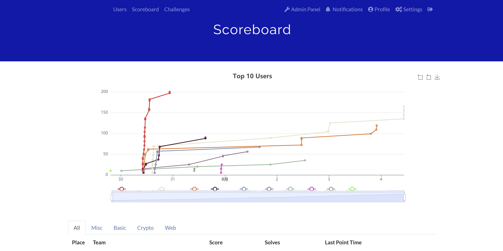

# CTFd 3.2.0+ Rank for A Single Category Plugin

> For CTFd 3.2.0+
> CTFd 3.2.0 Removed MomentJS and changed to dayjs.
> [See the change log](https://github.com/CTFd/CTFd/blob/7d56e59e1afcfbe919ce4050e458dfd6cba3fa00/CHANGELOG.md#320--2020-12-07)
> If your CTFd version below 3.2.0, please use the CTFd-3.2.0-below branch.

Add a page of ranks for a single category.

添加了单个分类的分数页。
